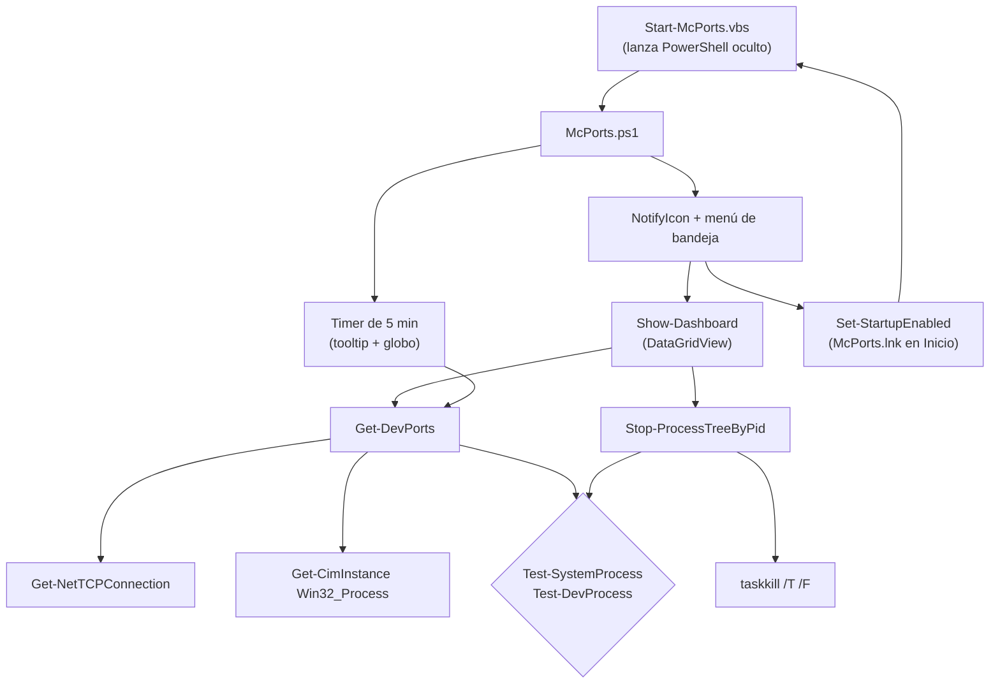

<div align="center">
  
  <h1>McPorts</h1>
  <p><b>Bandeja de Windows que muestra qué procesos de desarrollo ocupan puertos y limpia los servidores huérfanos.</b></p>
  
  
  
  
  <p>
    <a href="#-inicio-rápido">Inicio rápido</a> ·
    <a href="#-características">Características</a> ·
    <a href="#-arquitectura">Arquitectura</a> ·
    <a href="#-pruebas">Pruebas</a> ·
    <a href="#-lo-que-todavía-no-existe">Limitaciones</a>
  </p>
</div>

McPorts es un script de PowerShell (Windows Forms) que vive en la bandeja del sistema, lista los procesos que están
**escuchando en un puerto TCP** y marca como *huérfanos* los servidores de desarrollo (Node, PHP, Python, etc.) cuyo proceso
padre ya murió, para que puedas matarlos con un clic. **No** es un gestor genérico de procesos: por diseño solo ofrece matar
intérpretes de desarrollo reconocidos y nunca procesos del sistema.

## 🎬 Vista rápida

No hay capturas: es una aplicación gráfica de escritorio y no se ejecutó en un entorno de captura. El flujo real es:

```text
Start-McPorts.vbs ──> icono en la bandeja ──(clic izquierdo / "Ver puertos ocupados")──> ventana "Puertos y procesos"
   filas rojas = huérfano (marcado por defecto) · verdes = servidor de desarrollo activo · grises = otra app (intocable)
   ──> "Limpiar marcados" / "Limpiar todo lo no usado" ──> confirmación ──> taskkill /T /F ──> resumen (matados / omitidos)
```

## ✨ Características

| Característica | Detalle |
|---|---|
| Lista de puertos en escucha | `Get-NetTCPConnection -State Listen` agrupado por proceso; una sola consulta CIM masiva para ir rápido |
| Clasificación por color | Rojo *Huérfano*, verde *Activo* (dev), gris *Activo* (no dev, no seleccionable) |
| Protección del sistema | Lista de procesos críticos (`csrss`, `lsass`, `svchost`, `explorer`…) y cualquier ejecutable dentro de `%WINDIR%` se ocultan y nunca se matan |
| "Huérfano" acotado | Solo se calcula para `node`, `npm`, `php`, `python`, `ruby`, `deno`, `bun` y `cmd.exe` con comandos tipo vite/next/artisan/etc. |
| Doble comprobación al matar | `Stop-ProcessTreeByPid` revalida el proceso antes de `taskkill /PID … /T /F` y devuelve `Matado`, `OmitidoSeguridad` o `NoEncontrado` |
| Búsqueda y auto-actualización | Filtro instantáneo por proceso, puerto, PID o comando; casilla "Auto-actualizar (5s)" |
| Selección múltiple | Casillas por fila, "Marcar todos / ninguno / huérfanos" |
| Menú contextual | Matar este proceso, abrir `http://localhost:<primer puerto>`, copiar el comando completo; doble clic muestra el detalle |
| Bandeja | Tooltip con nº de huérfanos, aviso globo cada 5 min si hay huérfanos, "Iniciar con Windows" (acceso directo en la carpeta Inicio) |

## 🏗️ Arquitectura



## 🚀 Inicio rápido

| Requisito | Detalle |
|---|---|
| Sistema | Windows (usa Windows Forms, CIM y `taskkill`) |
| PowerShell | Windows PowerShell 5.1 (el script se analiza sin errores de sintaxis en 5.1; PowerShell 7 no se probó) |

```bash
git clone https://github.com/Luiss2080/McPorts.git
cd McPorts
```

1. Doble clic en `Start-McPorts.vbs` (arranca sin ventana de consola), **o** desde PowerShell:
   ```powershell
   powershell.exe -NoProfile -ExecutionPolicy Bypass -File .\McPorts.ps1
   ```
2. Busca el icono de McPorts en la bandeja; clic izquierdo abre la ventana.
3. Opcional: clic derecho > "Iniciar con Windows" para crear el acceso directo de arranque.

> No pude ejecutar la interfaz en este entorno; el comportamiento descrito sale de leer el código (`McPorts.ps1`, 572 líneas).

<details>
<summary>Estructura de archivos</summary>

```text
McPorts.ps1         # toda la lógica: recolección, ventana, bandeja, temporizador
Start-McPorts.vbs   # lanzador oculto (también es el destino del inicio automático)
docs/assets/logo.svg
```

</details>

## 🧪 Pruebas

No hay pruebas automatizadas. Lo único verificado es que `McPorts.ps1` analiza sin errores con el parser de PowerShell 5.1.
El historial muestra que se probó con un modo de *self-test* que después se retiró del código.

## 🔒 Seguridad

- Nunca lista ni mata procesos del sistema ni ejecutables dentro de `%WINDIR%`.
- Un proceso solo es elegible para matar si además es un intérprete de desarrollo conocido; la comprobación se repite justo antes de `taskkill`.
- Pide confirmación (Sí/No) antes de "Limpiar marcados" y "Limpiar todo lo no usado".
- El `.vbs` ejecuta PowerShell con `-ExecutionPolicy Bypass` (solo para ese script).

## 🚧 Lo que todavía no existe

- Solo Windows; sin instalador ni ejecutable firmado.
- Sin pruebas automatizadas.
- "Matar todos los huérfanos" en el menú de la bandeja **no pide confirmación** (la ventana sí).
- "Matar este proceso" del menú contextual tampoco pregunta antes.
- Un mensaje de la ventana ("Marcá el casillero…") tiene la codificación rota (mojibake) por cómo se guardó el archivo.
- Solo TCP en estado *Listen*; no muestra UDP ni conexiones salientes.
- No se pudo verificar qué pasa sin privilegios de administrador con procesos de otros usuarios.

## 📄 Licencia

Sin licencia definida: todos los derechos reservados por defecto.

<div align="center"><sub>Hecho por Luiss2080 · McPorts, para dejar de pelear con el puerto 3000</sub></div>
